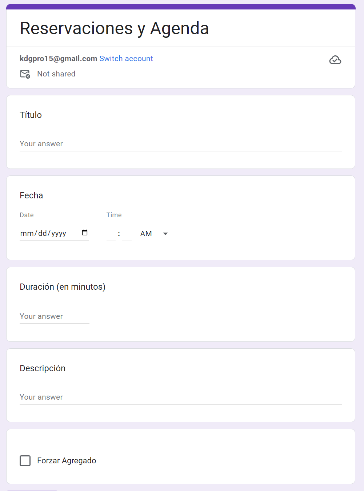

# Form Booking

## Description
Script created to integrate Google Forms with Google Calendar. The script is triggered when a new form is submitted and creates an event in the calendar with the information provided in the form and send an email confirming or letting the user know the event is already booked or not.

## Form Fields
- Título: Get the title of the event.
- Fecha: Get the date of the event -this is a date with time input-.
- Duracion: Number input to get the duration of the event.
- Descripción: Get the description of the event.
- Forzar: A checkbox item that gets the option to force the event creation even if the event is already booked.

